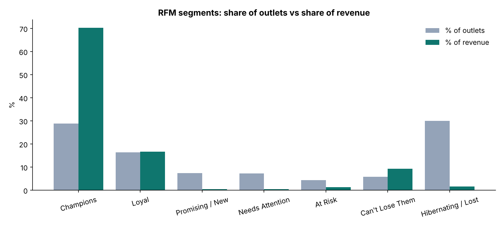
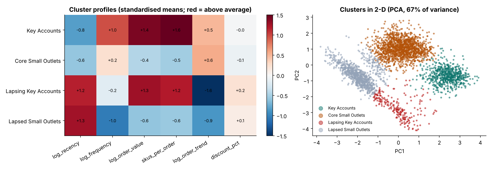
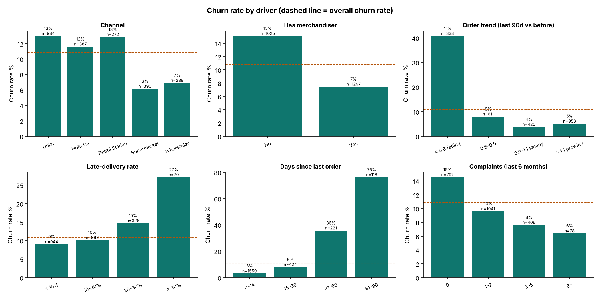
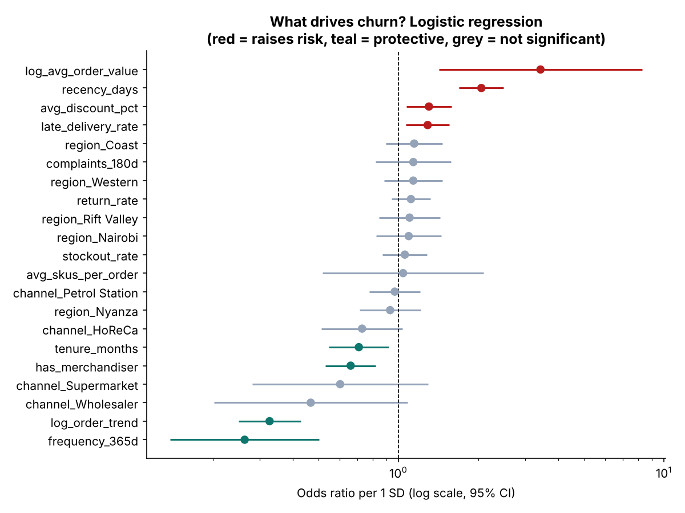
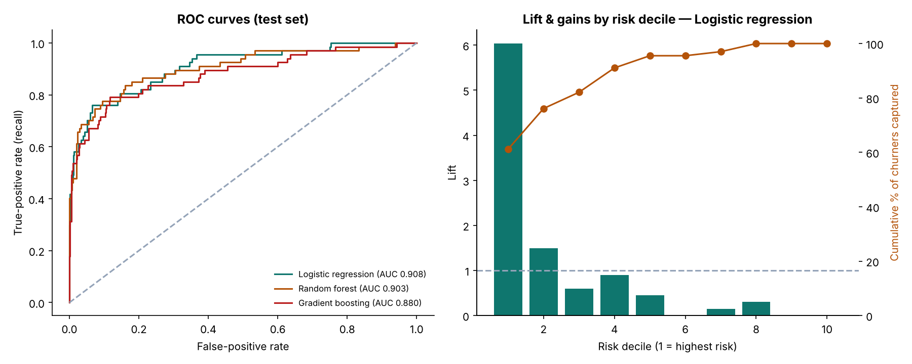
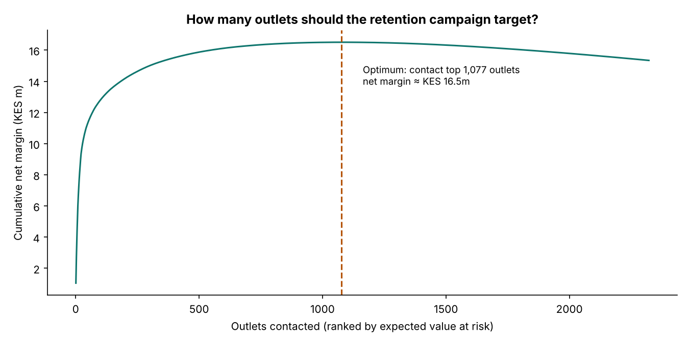

# Customer Segmentation & Churn Analysis — who are our customers, and who is about to leave?

An end-to-end analysis of **4,000 B2B retail outlets** (dukas, supermarkets, wholesalers, HoReCa, petrol stations) for an FMCG distributor in Kenya:

1. **Segmentation:** RFM scoring and K-means clustering to find who the customers are and what each group needs.
2. **Churn prediction:** a leakage-safe 90-day churn model (logistic regression, random forest, gradient boosting) to find who is about to stop buying, why, and who to call first.

Built in **Python** and rebuilt independently in **base R**. The two implementations agree on every logistic-regression coefficient (max difference 2.6 × 10⁻¹⁴), the same test AUC (0.908), and 99.97% of segment assignments.

> **Data note:** all data is **synthetic**, generated by [`data/generate_data.py`](data/generate_data.py): about 180k orders and 14k complaints from Jan 2025 to Sep 2026. Hidden drivers (price sensitivity, service quality, competition) shape behaviour, but only observable data is exported. No real company or customer data is used.

| | |
|---|---|
| 📓 **Full walkthrough, every step explained** | [`python/segmentation_and_churn.ipynb`](python/segmentation_and_churn.ipynb) |
| 📊 **R rebuild + results report** | [`R/segmentation_and_churn.R`](R/segmentation_and_churn.R) → [`outputs/r/R_results.md`](outputs/r/R_results.md) |
| 📞 **Ranked retention call list** | [`outputs/python/churn_risk_scores.csv`](outputs/python/churn_risk_scores.csv) |

---

## 1. Why do this analysis?

| Question | Why it matters |
|---|---|
| **Who are our customers?** | Outlets differ hugely in value and needs. One service model for everyone either over-serves small outlets or under-serves big ones. |
| **Who is about to leave?** | Keeping an outlet is far cheaper than winning a new one, and B2B customers *fade* before they leave, so there's a window to act. |
| **Which losses matter most?** | A churning wholesaler can be worth a hundred churning dukas. Retention budgets should follow **value at risk**, not headcount. |

---

## 2. Method

```
orders + complaints + outlet attributes
   └─► snapshot 30-Jun-2026: features from the PAST only (no leakage)
         ├─► PART A  Segmentation:  RFM quintiles → 7 named segments
         │                          K-means on 6 log-scaled behaviours → k chosen by silhouette (k = 4)
         └─► PART B  Churn:         label = active outlet with NO order in the next 90 days
                                    logistic regression · random forest · gradient boosting
                                    deterministic 75/25 split (same split in Python and R)
                                    ROC-AUC · PR-AUC · Brier · gains/lift · odds ratios · permutation importance
                                    → revenue at risk by segment → retention campaign economics
```

**Features:** recency, frequency, 12-month value, order size, range breadth (SKUs/order), **order trend** (last-90-day rate vs prior), discount dependence, late-delivery / stock-out / return rates, complaints, tenure, merchandiser coverage, channel and region.

---

## 3. Segmentation results

### RFM: the Pareto pattern

| Segment | % of outlets | % of revenue | Strategy |
|---|---:|---:|---|
| Champions | 29% | **70%** | Protect |
| Loyal | 16% | 17% | Grow share of wallet |
| Can't Lose Them | 6% | 9% | **Win back first** |
| Hibernating / Lost | 30% | 2% | Low-cost reactivation |



### K-means: four behavioural segments (silhouette-optimal k = 4)

| Segment | Outlets | Revenue share | Profile | Strategy |
|---|---:|---:|---|---|
| **Key Accounts** | 650 | **76%** | Supermarkets & wholesalers; frequent, large, broad orders | Protect: KAM, delivery SLAs |
| **Core Small Outlets** | 1,503 | 13% | Dukas, HoReCa, petrol stations; steady small orders | Serve efficiently, grow range |
| **Lapsing Key Accounts** | 227 | 9% | Big-basket outlets whose order trend has collapsed (median 0.15) | **Win back now** |
| **Lapsed Small Outlets** | 909 | 2% | Small outlets that have stopped ordering | SMS / telesales reactivation |



K-means found the split a seasoned commercial manager would draw, **big vs small × active vs fading**, from purchase behaviour alone.

---

## 4. Churn results

**Population:** 2,322 outlets active at the snapshot · **252 churned (10.9%)** within 90 days, worth KES 500m of prior-year sales.

### What drives churn?



| Driver | Churn rate |
|---|---|
| Order trend < 0.6 (fading) vs steady | **41%** vs 4% |
| 61–90 days silent vs ordered in last 2 weeks | **76%** vs 3% |
| > 30% late deliveries vs < 10% | **27%** vs 9% |
| No merchandiser vs merchandiser | **15%** vs 7.5% |
| Duka / petrol station vs supermarket | 13% vs 6% |

**An exposure-bias lesson:** churn *falls* as complaints rise. Active outlets order more, so they have more chances to complain, while outlets that are drifting away go quiet. Raw complaint counts measure activity as well as dissatisfaction.

### Logistic regression: independent effects (odds ratio per 1 SD)



- **Protective:** order frequency (0.26), order trend (0.33), merchandiser coverage (0.66), tenure (0.71)
- **Risk:** recency (2.1 per 18 days), late deliveries (1.3), discount dependence (1.3)
- **Not significant once these are controlled for:** complaints, stock-outs, returns, region, channel

### Model performance (held-out test set)

| Model | ROC-AUC | PR-AUC | Brier |
|---|---:|---:|---:|
| **Logistic regression** | **0.908** | 0.744 | **0.053** |
| Random forest | 0.903 | 0.747 | 0.069 |
| Gradient boosting | 0.880 | 0.706 | 0.057 |
| No model (baseline) | 0.500 | 0.117 | 0.104 |

The explainable logistic regression is the best model. **The riskiest 10% of outlets contain 61% of future churners (lift 6×), and the top 20% contain 76%.**



---

## 5. Putting it together: where is the money at risk?

| Segment | Active outlets | Actual churn | Share of revenue at risk |
|---|---:|---:|---:|
| Lapsing Key Accounts | **35** | 91% | **53%** |
| Key Accounts | 650 | 3% | 27% |
| Core Small Outlets | 1,503 | 8% | 14% |
| Lapsed Small Outlets | 134 | 66% | 7% |

**35 outlets hold over half the revenue at risk.** Ranking by expected value lost (probability × annual revenue), the top **50 outlets hold 61%** of the risk and the top **200 hold 77%**.



At an illustrative KES 1,500 per contact, a 25% save rate and 20% margin, net margin peaks at about **KES 16.5m** when contacting about 1,080 outlets. In practice: **personal visits for the top 100–200, cheap channels for the rest.**

---

## 6. Recommended actions

| Segment / signal | Action |
|---|---|
| Key Accounts | KAM coverage, delivery SLAs, monthly reviews, alert on any order-trend drop |
| Lapsing Key Accounts | Senior visit within 2 weeks, root-cause the service failure, tailored terms |
| Core Small Outlets | Route-optimised van sales, range bundles, merchandiser coverage where it pays |
| Lapsed Small Outlets | SMS / telesales reactivation; reassign to wholesalers if no response |
| Fading order trend (any outlet) | Automatic early-warning in the field-force app when trend < 0.6 |
| Late deliveries | Fix the controllable driver: delivery-slot reliability, stock-out prevention |

---

## 7. Where segmentation & churn analysis are used

| Industry | Segmentation | Churn |
|---|---|---|
| FMCG / distribution | Outlet tiering, route-to-market design | Outlet attrition early warning |
| Retail & e-commerce | Loyalty tiers, RFM targeting | Lapsed-shopper reactivation |
| Banking & micro-finance | Value tiers, product needs | Account closure, dormancy, loan attrition |
| Telecoms & mobile money | Usage-based bundles | Subscriber churn |
| Insurance | Risk and value segments | Policy lapse / non-renewal |
| SaaS & subscriptions | Usage personas | Cancellation prediction |
| Healthcare & NGOs | Patient / beneficiary profiles | Treatment drop-out, loss to follow-up |
| Energy (PAYG solar) | Consumption profiles | Payment default / disengagement |

---

## 8. Limitations and next steps

- **Synthetic data:** effect sizes are illustrative. On real data, validate on a later snapshot (out-of-time test).
- **Prediction ≠ prevention:** test retention actions against a random control group (uplift modelling).
- **Partial churn:** model share-of-wallet decline, not just full churn.
- **Survival analysis** (Cox models) to estimate *when* an outlet will churn.
- **Monitoring:** rescore monthly; track AUC and precision on each new cohort.

---

## 9. Run it

```bash
pip install -r requirements.txt
python data/generate_data.py                                    # optional: regenerate data
python python/build_notebook.py
jupyter nbconvert --to notebook --execute --inplace python/segmentation_and_churn.ipynb
Rscript R/segmentation_and_churn.R                              # base R only; run after the notebook for the cross-check
```

```
customer-segmentation-churn/
├── data/            generate_data.py · customers.csv · orders.csv · complaints.csv
├── python/          features.py (leakage-safe feature engineering) · build_notebook.py · segmentation_and_churn.ipynb
├── R/               segmentation_and_churn.R (independent rebuild + cross-check)
└── outputs/         python/ (charts, segments, scores, metrics) · r/ (charts, R_results.md)
```

**Stack:** Python · pandas · scikit-learn · statsmodels · matplotlib · R (base, stats, graphics)
