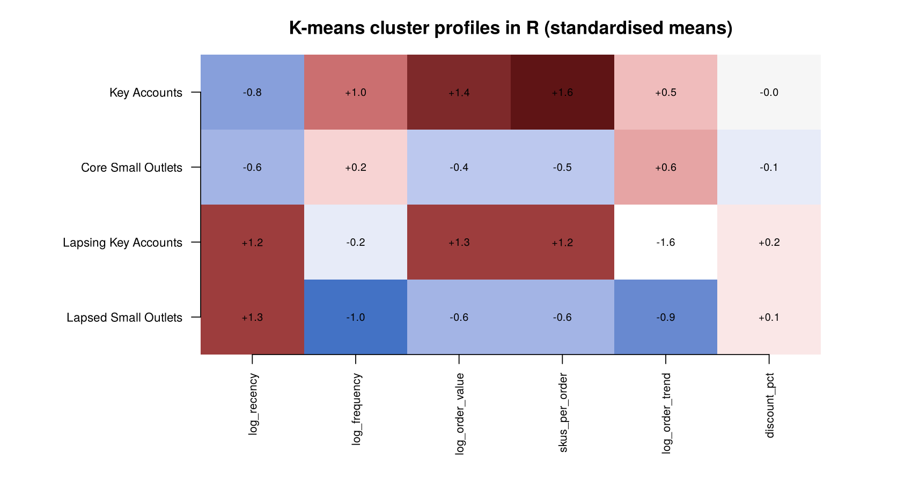
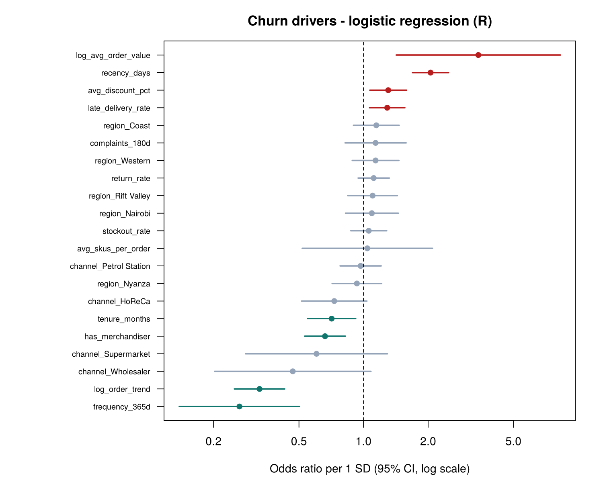
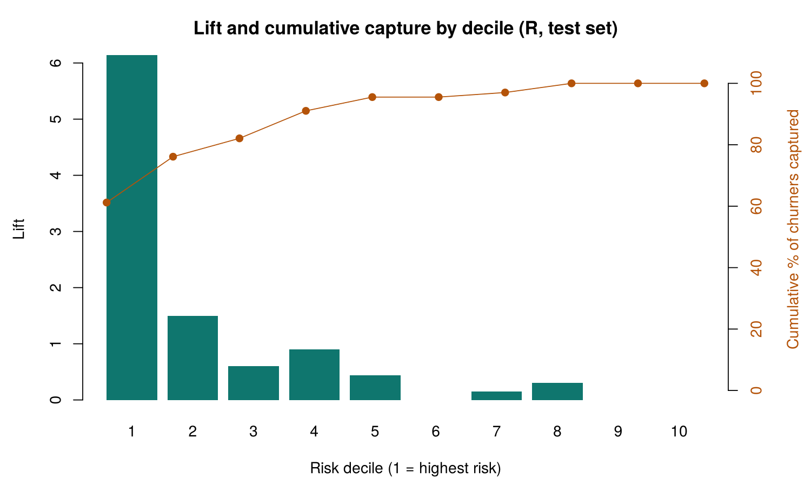

# Segmentation & Churn — R results (auto-generated by `R/segmentation_and_churn.R`)

*Snapshot 2026-06-30 · 3289 outlets segmented · 2322 active outlets modelled · churn = no order in next 90 days*

## Cross-check with the Python notebook

- coefficients compared: 21 | max relative odds-ratio difference: 2.6e-14 | RFM segment agreement: 99.97% | K-means segment agreement: 99.97%

Any disagreement is limited to a handful of borderline outlets: R's `kmeans()` (Hartigan-Wong) and scikit-learn (Lloyd, k-means++) use different algorithms and starting points, and RFM quintile cut-offs can split tied values differently. The segment *profiles* are the same.

## RFM segments

| segment | outlets | revenue_share |
| --- | --- | --- |
| Champions | 948 | 70.2% |
| Loyal | 540 | 16.6% |
| Promising / New | 244 | 0.5% |
| Needs Attention | 241 | 0.4% |
| At Risk | 141 | 1.3% |
| Can't Lose Them | 189 | 9.2% |
| Hibernating / Lost | 986 | 1.7% |

## K-means segments

| segment | outlets | median_recency | median_orders_12m | median_order_value | median_trend | revenue_share |
| --- | --- | --- | --- | --- | --- | --- |
| Key Accounts |  651 |   6.0 | 55 | 112317 | 1.01 | 75.8% |
| Core Small Outlets | 1503 |  10.0 | 28 |  12912 | 1.05 | 13.1% |
| Lapsing Key Accounts |  226 | 172.5 | 21 |  94529 | 0.15 | 9.4% |
| Lapsed Small Outlets |  909 | 220.0 |  8 |  11015 | 0.33 | 1.7% |

## Churn model (logistic regression, glm)

- Active outlets: 2322, churn rate 10.9% · test AUC **0.908**

| feature | odds_ratio | 95% CI | p_value |
| --- | --- | --- | --- |
| frequency_365d | 0.26 | 0.14 – 0.50 | 0.000 |
| log_order_trend | 0.33 | 0.25 – 0.43 | 0.000 |
| channel_Wholesaler | 0.47 | 0.20 – 1.08 | 0.076 |
| channel_Supermarket | 0.60 | 0.28 – 1.29 | 0.194 |
| has_merchandiser | 0.66 | 0.53 – 0.82 | 0.000 |
| tenure_months | 0.71 | 0.55 – 0.92 | 0.009 |
| channel_HoReCa | 0.73 | 0.51 – 1.04 | 0.079 |
| region_Nyanza | 0.93 | 0.71 – 1.21 | 0.599 |
| channel_Petrol Station | 0.97 | 0.78 – 1.21 | 0.782 |
| avg_skus_per_order | 1.04 | 0.52 – 2.10 | 0.909 |
| stockout_rate | 1.06 | 0.87 – 1.28 | 0.569 |
| region_Nairobi | 1.09 | 0.82 – 1.45 | 0.535 |
| region_Rift Valley | 1.10 | 0.85 – 1.44 | 0.473 |
| return_rate | 1.12 | 0.94 – 1.32 | 0.201 |
| region_Western | 1.14 | 0.89 – 1.46 | 0.312 |
| complaints_180d | 1.14 | 0.82 – 1.58 | 0.439 |
| region_Coast | 1.15 | 0.90 – 1.47 | 0.273 |
| late_delivery_rate | 1.29 | 1.07 – 1.56 | 0.009 |
| avg_discount_pct | 1.30 | 1.07 – 1.59 | 0.008 |
| recency_days | 2.05 | 1.69 – 2.49 | 0.000 |
| log_avg_order_value | 3.43 | 1.42 – 8.27 | 0.006 |

## Gains (test set)

| decile | churners | outlets | cumulative_capture | lift |
| --- | --- | --- | --- | --- |
|  1 | 41 | 57 | 61% | 6.14 |
|  2 | 10 | 57 | 76% | 1.50 |
|  3 |  4 | 57 | 82% | 0.60 |
|  4 |  6 | 57 | 91% | 0.90 |
|  5 |  3 | 58 | 96% | 0.44 |
|  6 |  0 | 57 | 96% | 0.00 |
|  7 |  1 | 57 | 97% | 0.15 |
|  8 |  2 | 57 | 100% | 0.30 |
|  9 |  0 | 57 | 100% | 0.00 |
| 10 |  0 | 58 | 100% | 0.00 |

